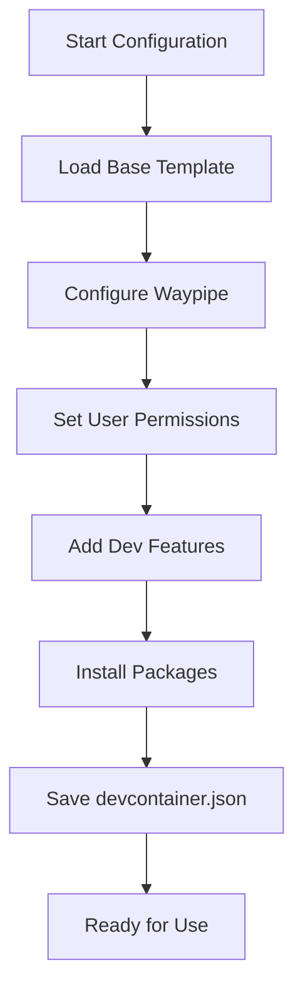
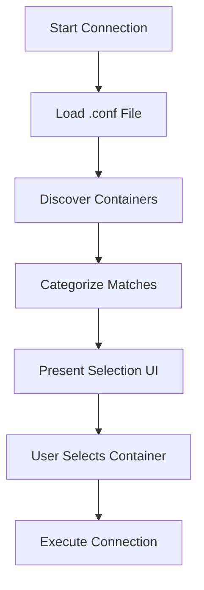

# Devcontainer God 🚀

A comprehensive and professional devcontainer management tool that provides intelligent configuration, container discovery, and seamless connection capabilities for VS Code development environments.

## 🌟 Features

| Feature | Description | Supported OS |
|---------|-------------|---------------|
| **🎯 Smart Container Discovery** | Intelligent detection and categorization of running devcontainers | All |
| **📺 Waypipe Integration** | Forward container GUI applications to host Wayland display | Linux (Wayland) |
| **🔧 Interactive Configuration** | Step-by-step devcontainer setup with templates | All |
| **📦 Package Management** | Search and install Debian packages from CLI | All |
| **🏪 Feature Marketplace** | Direct integration with devcontainer features | All |
| **👤 User Management** | Advanced UID/GID mapping and permission handling | All |
| **🔗 Seamless Connection** | One-click connection to running containers | All |

## 📁 Project Structure

```
.devcontainer/
├── cmd/                          # Main application code
│   ├── main.py                   # Entry point and CLI interface
│   ├── core/                     # Core functionality modules
│   │   ├── __init__.py
│   │   ├── config.py             # Configuration management
│   │   ├── docker.py             # Docker container operations
│   │   ├── ui.py                 # User interface components
│   │   └── connection.py         # Connection orchestration
│   ├── configure/                # Configuration modules
│   │   ├── handle_waypipe.py     # Waypipe GUI support
│   │   ├── handle_user.py        # User and permissions
│   │   ├── handle_add_feature.py # Devcontainer features
│   │   └── handle_add_programs.py# Package installation
│   ├── utils/                    # Utility functions
│   │   └── utils.py              # JSON/file operations
│   └── scripts/                  # Helper scripts
│       └── initializeCommand.py  # Waypipe initialization
├── templates/                    # Configuration templates
│   ├── main.jsonc               # Base devcontainer template
│   ├── waypipe.jsonc            # Waypipe configuration
│   └── user.jsonc               # User settings template
├── devcontainer.mk              # Build system
├── requirements.txt             # Python dependencies
└── ReadMe.md                   # This file
```

## 🚀 Quick Start

### Prerequisites

1. **Docker** - Container runtime
2. **VS Code** with Dev Containers extension (or devcontainer-cli)
3. **Python 3.8+** with pip
4. **Make** - Build automation

### Installation & Setup

1. **Clone and Navigate**
   ```bash
   cd your-project-directory
   git clone <this-repo> .devcontainer
   cd .devcontainer
   ```

2. **Configure Your Devcontainer**
   ```bash
   make conf-container
   ```
   
   This launches an interactive wizard that will:
   - 🎯 Configure base settings
   - 📺 Set up Waypipe (Linux GUI support)
   - 👤 Configure user permissions
   - 🔧 Add devcontainer features
   - 📦 Install additional packages

3. **Start Your Devcontainer**
   - **VS Code**: `Ctrl+Shift+P` → "Rebuild and Reopen in Container"
   - **CLI**: `devcontainer up --workspace-folder .`

4. **Connect to Running Container**
   ```bash
   make conn
   ```

## 🎯 Core Workflows

### Configuration Workflow



### Connection Workflow



## 🔧 Configuration Options

### Waypipe (GUI Support)
- **Purpose**: Forward GUI applications from container to host
- **Requirements**: Linux with Wayland
- **Features**: Automatic socket setup, compression, environment variables

### User Management
- **Default User**: `vscode` with UID 1000, GID 1000
- **Custom Options**: Select from system users/groups or specify custom IDs
- **Permission Mapping**: Seamless file ownership between host and container

### Package Installation
- **Search**: Interactive Debian package search
- **Preview**: Package descriptions and dependencies
- **Installation**: Automated via post-creation commands

### Feature Integration
- **Marketplace**: Direct access to devcontainer features
- **Categories**: Languages, tools, runtimes, and more
- **Versioning**: Automatic latest version selection

## 📋 Command Reference

### Main Commands
```bash
# Interactive configuration wizard
make conf-container

# Connect to running devcontainer
make conn

# Direct Python usage
python .devcontainer/cmd/main.py --conf    # Configure
python .devcontainer/cmd/main.py --conn    # Connect
```

### Configuration Files

#### `.devcontainer/.conf`
Generated during configuration, contains:
- `CONTAINER_NAME`: Display name for container matching
- `REMOTE_USER`: Username for container connections
- `USER_ID`/`GROUP_ID`: Permission mapping
- `IMAGE`: Base container image

#### `devcontainer.json`
Final devcontainer configuration with all selected features and settings.

## 🐛 Troubleshooting

### Common Issues

**Container Not Found**
```bash
# Check running containers
docker ps

# Ensure VS Code devcontainer is running
# Look for containers with names like: vsc-project-name-hash-features-uid
```

**Permission Issues**
```bash
# Verify UID/GID mapping in .conf file
cat .devcontainer/.conf

# Reconfigure with correct permissions
make conf-container
```

**Waypipe Not Working**
```bash
# Check if waypipe is installed on host
which waypipe

# Verify Wayland session
echo $WAYLAND_DISPLAY

# Check socket permissions
ls -la /tmp/waypipe/
```

## 🤝 Contributing

1. **Fork** the repository
2. **Create** a feature branch
3. **Add** comprehensive documentation
4. **Test** with various configurations
5. **Submit** a pull request

### Development Guidelines

- **Modularity**: Keep functions focused and single-purpose
- **Documentation**: Comprehensive docstrings for all functions
- **Error Handling**: Graceful degradation with helpful messages
- **Type Hints**: Use type annotations for clarity
- **Testing**: Test across different environments

## 📝 License

This project is licensed under the MIT License - see the LICENSE file for details.

## 🙏 Acknowledgments

- **VS Code Team** for the excellent devcontainer specification
- **Docker** for containerization technology
- **Waypipe Project** for GUI forwarding capabilities
- **InquirerPy** for beautiful CLI interfaces

---

**Made with ❤️ by the Devcontainer God Project**